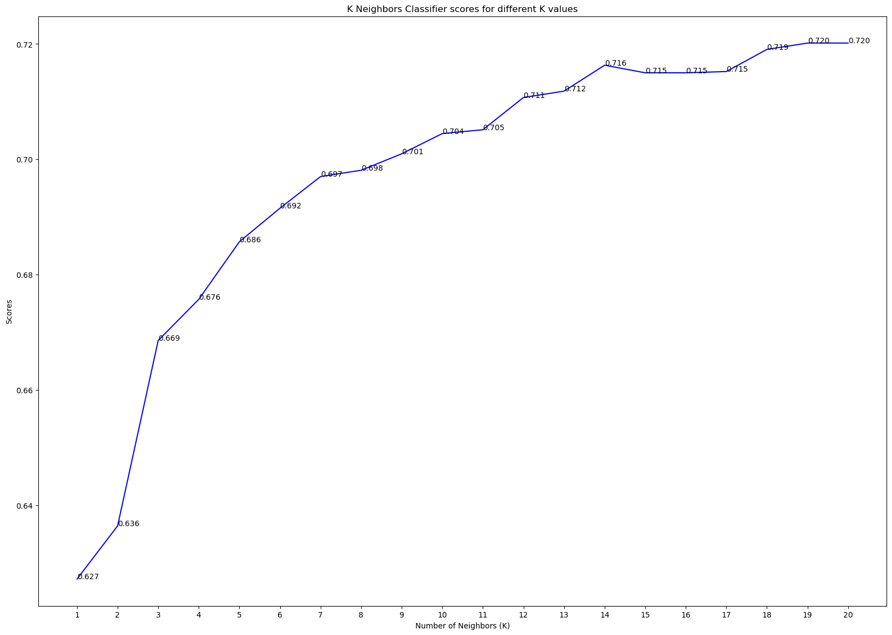

# SCTP_ADA_CSP-Healthcare-Predictive

# SCTP Associate Data Analyst Capstone Project

Problem Statement:
Heart disease is a leading cause of mortality worldwide. Early detection and accurate prediction of heart disease can significantly improve patient outcomes by enabling timely intervention and preventive measures. The objective of this project is to develop a machine learning model that can effectively predict the presence or absence of heart disease based on various medical and lifestyle factors.

Research Objective:
The goal of this project is to build a predictive model that can accurately classify individuals as either having or not having heart disease.  By analysing a comprehensive set of patient attributes,
including demographic, clinical, and lifestyle factors, the model aims to identify patterns and features indicative of the presence or absence of heart disease.

# Cardiovascular Disease
Cardiovascular disease (CVD) is any disease involving the heart or blood vessels.  CVDs constitute a class of diseases that includes:  coronary artery diseases (e.g. angina, heart attack), stroke, heart failure, hypertensive heart disease, rheumatic heart disease, cardiomyopathy, abnormal heart rhythms, congenital heart disease, valvular heart disease, carditis, aortic aneurysms, peripheral artery disease, thromboembolic disease, and venous thrombosis.

The underlying mechanisms vary depending on the disease.  It is estimated that dietary risk factors are associated with 53% of CVD deaths.  Coronary artery disease, stroke, and peripheral artery disease involve atherosclerosis.  This may be caused by high blood pressure, smoking, diabetes mellitus, lack of exercise, obesity, high blood cholesterol, poor diet, excessive alcohol consumption, and poor sleep, among other things.  High blood pressure is estimated to account for approximately 13% of CVD deaths, while tobacco accounts for 9%, diabetes 6%, lack of exercise 6%, and obesity 5%.  Rheumatic heart disease may follow untreated strep throat.

It is estimated that up to 90% of CVD may be preventable.  Prevention of CVD involves improving risk factors through: healthy eating, exercise, avoidance of tobacco smoke and limiting alcohol intake.  Treating risk factors, such as high blood pressure, blood lipids and diabetes is also beneficial.  Treating people who have strep throat with antibiotics can decrease the risk of rheumatic heart disease.  The use of aspirin in people who are otherwise healthy is of unclear benefit.

Cardiovascular diseases are the leading cause of death worldwide except Africa.  Together CVD resulted in 17.9 million deaths (32.1%) in 2015, up from 12.3 million (25.8%) in 1990.  Deaths, at a given age, from CVD are more common and have been increasing in much of the developing world, while rates have declined in most of the developed world since the 1970s.  Coronary artery disease and stroke account for 80% of CVD deaths in males and 75% of CVD deaths in females.  Most cardiovascular disease affects older adults. In the United States 11% of people between 20 and 40 have CVD, while 37% between 40 and 60, 71% of people between 60 and 80, and 85% of people over 80 have CVD.  The average age of death from coronary artery disease in the developed world is around 80, while it is around 68 in the developing world.  CVD is typically diagnosed seven to ten years earlier in men than in women.

# Machine Learning and Deep Learning

Machine learning (ML) is an umbrella term for solving problems for which development of algorithms by human programmers would be cost-prohibitive, and instead the problems are solved by helping machines "discover" their "own" algorithms, without needing to be explicitly told what to do by any human-developed algorithms.  Recently, generative artificial neural networks have been able to surpass results of many previous approaches.  Machine-learning approaches have been applied to large language models, computer vision, speech recognition, email filtering, agriculture and medicine, where it is too costly to develop algorithms to perform the needed tasks.

The mathematical foundations of ML are provided by mathematical optimization (mathematical programming) methods. Data mining is a related (parallel) field of study, focusing on exploratory data analysis through unsupervised learning.

ML is known in its application across business problems under the name predictive analytics. Although not all machine learning is statistically based, computational statistics is an important source of the field's methods.

Machine learning approaches are traditionally divided into different categories, which correspond to learning paradigms, depending on the nature of the "signal" or "feedback" available to the learning system:
* Supervised learning: The computer is presented with example inputs and their desired outputs, given by a "teacher", and the goal is to learn a general rule that maps inputs to outputs.
* Unsupervised learning: No labels are given to the learning algorithm, leaving it on its own to find structure in its input. Unsupervised learning can be a goal in itself (discovering hidden patterns in data) or a means towards an end (feature learning).
* Semi-supervised learning: Falling between unsupervised learning (without any labeled training data) and supervised learning (with completely labeled training data). Some of the training examples are missing training labels, yet many machine-learning researchers have found that unlabeled data, when used in conjunction with a small amount of labeled data, can produce a considerable improvement in learning accuracy.
* Reinforcement learning: A computer program interacts with a dynamic environment in which it must perform a certain goal (such as driving a vehicle or playing a game against an opponent). As it navigates its problem space, the program is provided feedback that's analogous to rewards, which it tries to maximize. Although each algorithm has advantages and limitations, no single algorithm works for all problems.

# Machine Learning and Heart Disease
Machine Learning can play an essential role in predicting presence/absence of Heart Disease. Such information, if predicted well in advance, can provide important insights to doctors who can then adapt their diagnosis and treatment per patient basis. For the current project, I will be using 4 algorithms to compare their results.  The algorithms are:

* K Neighbors Classifier: This classifier looks for the classes of K nearest neighbors of a given data point and based on the majority class, assigns a class to this data point.

* Decision Tree Classifier: This classifier assigns class values to each data point based on a decision tree that was created by the classifier.

* Random Forest Classifier: This classifier creates a forest of trees where each tree is formed from random selection of features from the total features.

* Support Vector Classifier: This classifier aims at forming a hyperplane that can separate the classes as much as possible by adjusting the distance between data points and the hyperplane.

# Data Source
The dataset provided for this project is a subset of data our team worked on for a project of Parkway Pantai to understand the influence of various factors on the heart disease.

[Dataset](cardio_data.csv)

Data Dictionary:
|Column Name|Description|Type|Unit|Remarks|
|:--|:--|:--|:--|:--|
|date|The date on which examination was done|DATE|NONE| |
|country|The country name of the patient|STRING|NONE| |
|id|The unique ID of the patient|INT|NONE|Primary Key|
|active|The physical activity of the patient|BINARY|NONE| |
|age|The age of the patient|INT|DAYS| |
|alco|Alcohol intake|BINARY|NONE| |
|ap_hi|Systolic blood pressure|INT|NONE| |
|ap_lo|Diastolic blood pressure|INT|NONE| |
|cholesterol|Cholesterol level of the patient|INT|NONE|1-low, 2-normal, 3-high|
|gender|The gender of the patient|INT|NONE|1-Male, 2-Female|
|gluc|Glucose level of the patient|INT|NONE|1-low, 2-normal, 3-high|
|height|Height of the patient|INT|CM| |
|occupation|Occupation of the patient|STRING|NONE| |
|smoke|Presence of smoking|BINARY|NONE| |
|weight|Weight of the patient|FLOAT|KG| |
|disease|Presence of disease|BINARY|NONE|Target Variable|

# Data Preparation
As most machine learning algorithms cannot handle categorical variables, I used Label Encoding to modified 2 variables: country and occupation. Label Encoding is where each category in the variable is assigned an integer value from 1 to N where N is the number of categories of the variable.
* country: 1-India, 2-Indonesia, 3-Malaysia, 4-Singapore
* occupation:
  - 1-Accountant
  - 2-Architect
  - 3-Chef
  - 4-Doctor
  - 5-Engineer
  - 6-Lawyer
  - 7-Nurse
  - 8-Teacher
  - 0-Others

Using the info() method, I obtained more information of the data: 

Using the describe() method, I obtained statistics of the data: 

Using the hist() method, I obtained the pictorial view of the data: 

From the statistics and histograms of the data, I realised that there were errors in the following variables:
* ap_hi
* ap_lo
* height
* weight

To resolve the issue, I will treat the errors as outliers and remove them:
* ap_hi:  --> 
* ap_lo:  --> 
* height:  --> 
* weight:  --> 

Note that outliers often skew the results of statistical analyses on the dataset, which leads to less effective models.

# Data Processing
Before deploying the Machine Learning algorithms, I employed two different and separate methods to further process my data:
* Standardise Scaling: Variables with different ranges, units of measurement or orders of magnitudes will lead to biased model of performance. So by standardise scaling all the numerical variables, we can build a more accurate and effective machine learning models.
* Data Aggregating and binning: Having too many variables makes machine learning models inefficient.  Binning also reduces the complexities of the machine learning models.
  - Body Mass Index (BMI) $= \frac{weight}{height^2}$
  - Mean Arterial Pressure (MAP) $= \frac{2\times DiastolicBP+ SystolicBP}{3}$

The following correlation matrices is generated after the data processing:
* Standardise Scaling: 
* Data Aggregating and binning: 

# Results

| |Standardise Scaling|Data Aggregating|
|:--|:--:|:--:|
|K Neighbors Classifier| Max Score = 72.0%| Max Score = 62.5%|
|Decision Tree Classifier| Max Score = 63.6%| Max Score = 42.7% |
|Random Forest Classifier| Max Score = 72.4%| Max Score = 48.5%|
|Support Vector Classifier| Max Score = 73.0%| Max Score = 67.7%|

# Conclusion
* Overall, Support Vector Classifier has the best score at 73.0% using RBF as kernel.
* In general, Data Aggregating and Binning produced less effective models than Standardised Scaling but have a much faster process time.

# Future Developments
I intend to extend my research by working on the following:
* Logistic Regression
* Naive Bayes Classifier
* Deep Learning Models

# SAFRA Swim For Hope
<a href="https://www.safras4h.sg/donate!P00589KZ">Please support</a>
